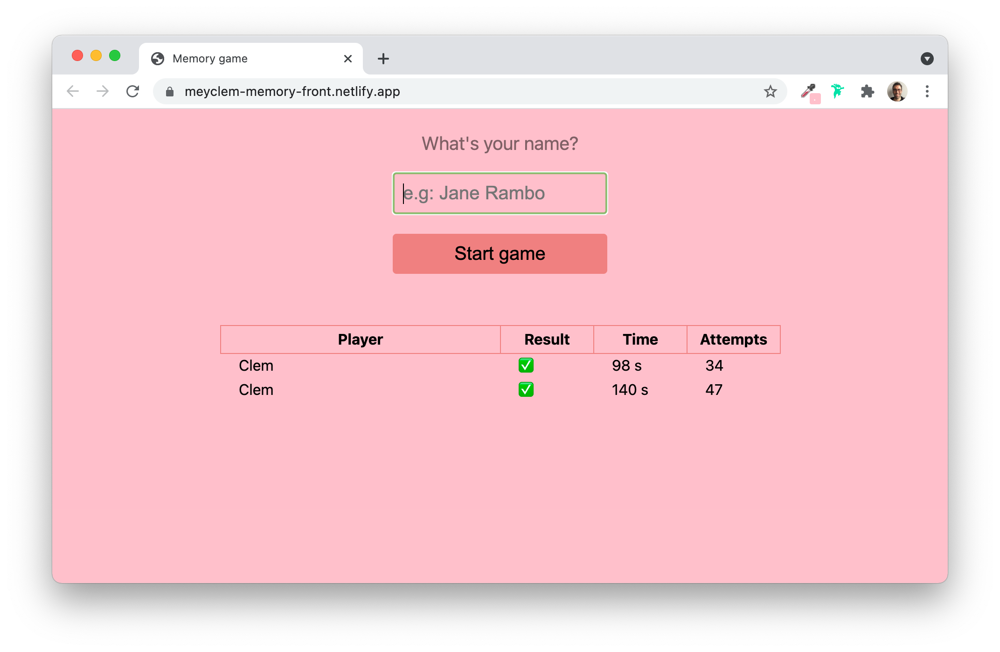
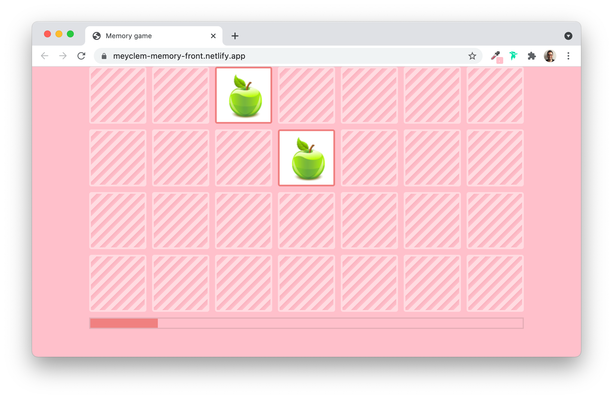
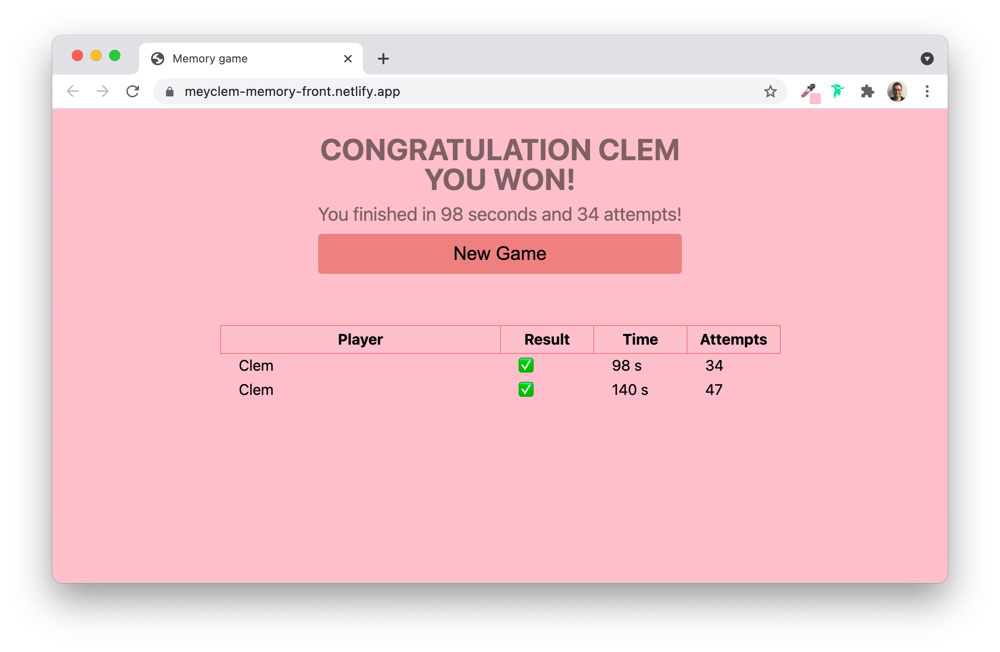
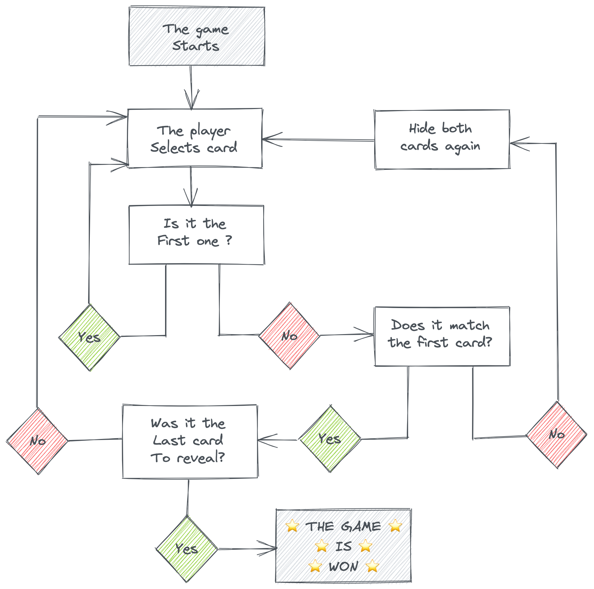

# The Frontend application

You can find the code in the [client](../client) directory.

Here's some preview of what the game looks like:


> Before the game starts


> During the game


> End game screen

When the application is started, [**Webpack**](https://webpack.js.org/) will *compile* the code and serve it from the `client/dist` folder.

The entry file is the main Javascript file added to the `dist/index.html` by Webpack.

It means that all the Javascript code written in `client/src/index.js` will be transformed **so the browser can read and execute it**.

It includes all the code **written** AND **imported** in the entry file.

For example:
```js
// client/src/index.js
import "../styles/scss/_index.scss"
import { checkApiStatus } from "./utils"
import { Game } from "./game"
// [...]
```
> All those files will be imported and compiled so the browser can understand them.

## The logic of the game

The logic of our game is written in `client/src/game.js`. As you can see above, it is imported in the main Javascript file.

The game use [**OOP**](https://medium.com/@luke_smaki/javascript-es6-classes-8a34b0a6720a) (**O**bject **O**riented **P**rogramming), meaning we define a `Game` class that holds the logic.

Here's the flow of the game:



Don't hesitate to read the comments in `client/src/game.js`. Important functions are commented with [jsdocs](https://jsdoc.app/) to give you hints on hover 👀.

## Tests

Have a look at the tests sample you can find in `client/test`.

It is not complete because the current tests don't cover all the cases but it's an exemple of how you can test DOM elements with `jest`!
